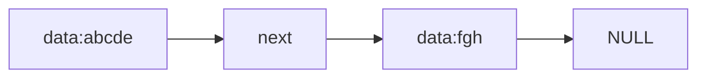
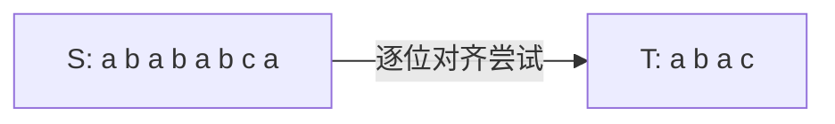
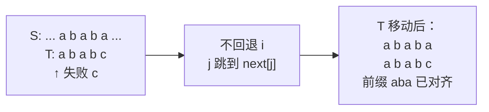
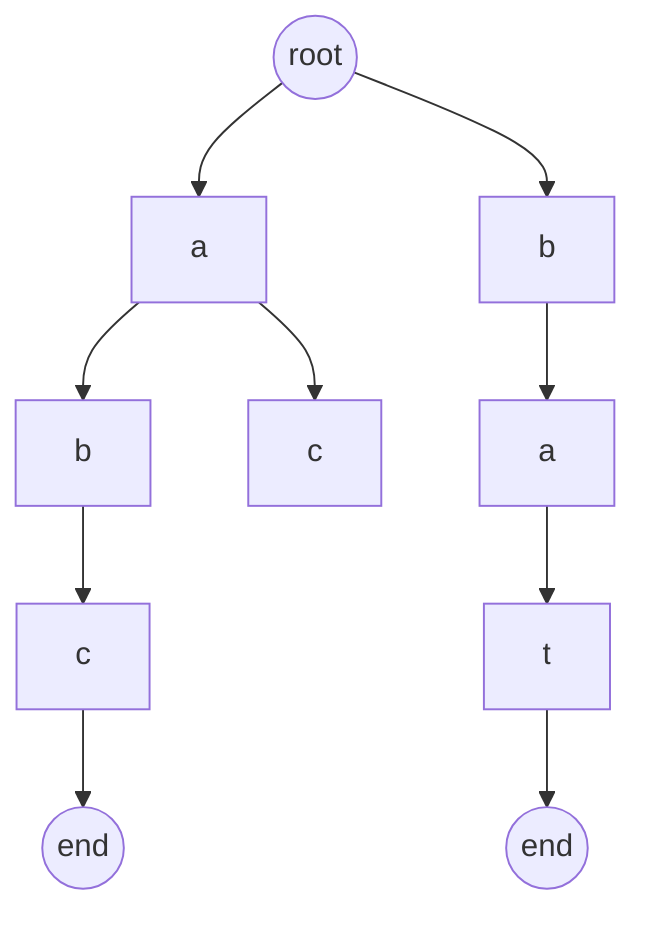

# 串

> 串是元素受限的线性表（元素为字符）。重点在**存储方式**与**模式匹配算法**，Trie 是串的多叉树延伸。

## 一、串的定义

**串**：由零个或多个字符组成的有限序列。

```
S = "abcde"
len(S) = 5
S[0] = 'a'
```

- **空串** `""`：长度为 0
- **空格串** `" "`：含空格字符，长度非 0
- **子串**：串中任意连续字符组成的子序列
- **主串**：包含子串的原串
- **位置**：字符在串中的序号（从 0 或 1 起，依实现而定）

> 与线性表的区别：线性表关注"单个元素的操作"，串关注"整体/子串的匹配与替换"。

## 二、串的存储结构

### 2.1 顺序串

字符存放在连续内存中，最常用。

| 实现 | 说明 | 代表 |
|------|------|------|
| 定长顺序串 | 编译期固定长度 | C `char[256]` |
| 堆分配串 | 运行时动态分配 | Go `string`、C++ `std::string` |

```go
// Go 中的 string：底层是只读 byte 切片
type StringHeader struct {
    Data uintptr  // 指向底层字节数组
    Len  int
}
```

**Go string 的两个特性**：
- **不可变**：修改会触发新串分配，赋值仅拷贝头部（24 字节）
- **零拷贝切片**：`s[i:j]` 共享底层字节数组，O(1)

### 2.2 链串

节点存字符 + 指针，**非主流**（缓存不友好、空间浪费大）。

```go
type Node struct {
    Ch   byte
    Next *Node
}
```

改进：每节点存多个字符（块链），降低指针占比。

> 实际工程中几乎都用顺序串；链串仅在特定教学场景出现。

### 2.3 块链存储



每个节点存固定大小字符块，平衡存储密度与操作灵活性。

## 三、模式匹配

**模式匹配**：在主串 `S` 中查找子串 `T`（模式串）首次出现的位置。

### 3.1 朴素匹配 BF（Brute-Force）



```go
func bfMatch(s, t string) int {
    i, j := 0, 0
    for i < len(s) && j < len(t) {
        if s[i] == t[j] {
            i++
            j++
        } else {
            i = i - j + 1  // 主串回退到本轮起点+1
            j = 0
        }
    }
    if j == len(t) {
        return i - j
    }
    return -1
}
```

| 情况 | 复杂度 |
|------|------|
| 最好 | O(n + m) |
| 最坏 | O(n·m)（如 `S="aaaaaab"`，`T="aaab"`） |

**问题**：主串指针 `i` 反复回退，前缀已匹配信息被丢弃。

### 3.2 KMP 算法

KMP 的核心：**利用已匹配前缀，避免主串指针回退**。

#### 核心思想

当 `T[j]` 匹配失败时，主串指针 `i` 不动，模式串指针 `j` 跳到 `next[j]`。



#### next 数组的含义

`next[j]` = `T[0..j-1]` 的"最长相等前后缀长度"。

```
T     =  a  b  a  b  c
next  =  -1 0  0  1  2
```

| j | T[0..j-1] | 最长相等前后缀 | next[j] |
|---|-----------|--------------|---------|
| 0 | （空） | — | -1 |
| 1 | `a` | 无 | 0 |
| 2 | `ab` | 无 | 0 |
| 3 | `aba` | `a` | 1 |
| 4 | `abab` | `ab` | 2 |

#### 构造 next 数组

```go
func buildNext(t string) []int {
    n := len(t)
    next := make([]int, n)
    next[0] = -1
    k, j := -1, 0
    for j < n-1 {
        if k == -1 || t[k] == t[j] {
            k++
            j++
            next[j] = k
        } else {
            k = next[k]  // 关键：失配时回退到 next[k]
        }
    }
    return next
}
```

#### KMP 匹配

```go
func kmpMatch(s, t string) int {
    next := buildNext(t)
    i, j := 0, 0
    for i < len(s) && j < len(t) {
        if j == -1 || s[i] == t[j] {
            i++
            j++
        } else {
            j = next[j]  // 主串 i 不动，仅模式串 j 跳转
        }
    }
    if j == len(t) {
        return i - j
    }
    return -1
}
```

| 算法 | 预处理 | 匹配 | 空间 |
|------|------|------|------|
| BF | 0 | O(n·m) | O(1) |
| KMP | O(m) | O(n) | O(m) |

#### next 优化（nextval）

当 `T[j] == T[next[j]]` 时，跳过去仍失败，可直接跳到 `next[next[j]]`：

```go
// 在构造 next 时同步优化
for j < n-1 {
    if k == -1 || t[k] == t[j] {
        k++
        j++
        if t[k] == t[j] {
            next[j] = next[k]
        } else {
            next[j] = k
        }
    } else {
        k = next[k]
    }
}
```

### 3.3 算法对比

| 算法 | 主串回退 | 复杂度 | 实现难度 | 适用 |
|------|---------|------|---------|------|
| BF | 是 | O(n·m) | 易 | 短串、几乎匹配 |
| KMP | 否 | O(n+m) | 中 | 长串、需多次查询 |
| BM（坏字符+好后缀） | 否 | 平均 O(n/m) | 难 | 工程实现（grep） |
| Sunday | 偏移规则 | 平均 O(n/m) | 中 | 文本匹配 |

> LeetCode `strStr()` 等题解细节见 [algorithm/串匹配.md](../algorithm/串匹配.md)。

## 四、Trie 树（字典树）

**Trie**：利用字符串的**公共前缀**组织存储的多叉树。

### 4.1 结构



图中插入的串：`"abc"`、`"bat"`。

```go
type TrieNode struct {
    children [26]*TrieNode  // 26 叉（小写字母）
    isEnd    bool
}

type Trie struct {
    root *TrieNode
}
```

### 4.2 核心操作

```go
func (t *Trie) Insert(word string) {
    p := t.root
    for i := 0; i < len(word); i++ {
        idx := word[i] - 'a'
        if p.children[idx] == nil {
            p.children[idx] = &TrieNode{}
        }
        p = p.children[idx]
    }
    p.isEnd = true
}

func (t *Trie) Search(word string) bool {
    p := t.root
    for i := 0; i < len(word); i++ {
        idx := word[i] - 'a'
        if p.children[idx] == nil {
            return false
        }
        p = p.children[idx]
    }
    return p.isEnd
}

func (t *Trie) StartsWith(prefix string) bool {
    p := t.root
    for i := 0; i < len(prefix); i++ {
        idx := prefix[i] - 'a'
        if p.children[idx] == nil {
            return false
        }
        p = p.children[idx]
    }
    return true
}
```

| 操作 | 复杂度 | 说明 |
|------|------|------|
| Insert | O(L) | L 为串长 |
| Search | O(L) | 与字典大小无关 |
| StartsWith | O(L) | 前缀匹配 |

### 4.3 时空权衡

| 实现 | 优点 | 缺点 | 代表 |
|------|------|------|------|
| 数组指针（26 叉） | O(L) 查找、无冲突 | 空间浪费大 | 标准 Trie |
| 哈希表 children | 任意字符集 | 哈希开销、缓存差 | Go 通用版 |
| 压缩 Trie（Radix） | 减少空节点 | 实现复杂 | 路由表 |
| 双数组 Trie | 紧凑、缓存友好 | 删除复杂 | 中文分词 |

### 4.4 工程应用

- **前缀提示**：搜索引擎、IDE 自动补全
- **词频统计**：Trie + count 字段
- **敏感词过滤**：AC 自动机 = Trie + KMP 失配指针
- **路由匹配**：Go `httprouter` 用 Radix Tree
- **IP 路由表**：前缀匹配 LPM

## 五、串的工程实现视角

### 5.1 Go string 与 []byte 转换

```go
s := "hello"
b := []byte(s)    // 发生拷贝 O(n)
s2 := string(b)   // 发生拷贝 O(n)
```

**优化**：`unsafe` 包零拷贝（仅限读取，且字节切片不可修改）。

### 5.2 字符串拼接性能

| 方式 | 复杂度 | 适用 |
|------|------|------|
| `s + s2` | O(n)（每次分配） | 单次拼接 |
| `fmt.Sprintf` | O(n) + 反射开销 | 格式化 |
| `strings.Join` | 一次预分配 | 批量拼接 |
| `strings.Builder` | 摊销 O(n) | 循环拼接 |
| `bytes.Buffer` | 同 Builder | 字节拼接 |

```go
// 推荐：循环拼接用 Builder
var b strings.Builder
for _, s := range strs {
    b.WriteString(s)
}
result := b.String()
```

### 5.3 字符编码

| 编码 | 字符宽度 | 代表语言 |
|------|---------|---------|
| ASCII | 1 byte | 英文 |
| GBK | 1-2 byte | 中文旧系统 |
| UTF-8 | 1-4 byte | 主流 |
| UTF-16 | 2-4 byte | Java/C# 内部 |

**Go 的 rune 类型**：`rune = int32`，表示一个 Unicode 码点。遍历字符串：

```go
s := "你好"
// 按 byte 遍历：len(s)=6，得到 6 个字节
for i := 0; i < len(s); i++ { ... }
// 按 rune 遍历：得到 2 个字符
for i, r := range s { ... }
```

## 六、面试要点

### 6.1 高频概念题

1. **串和线性表的区别？**
   - 元素类型限定为字符；操作集中在整体匹配与子串，而非单点访问。

2. **KMP 相比 BF 的核心改进是什么？**
   - 主串指针不回退，用 `next` 数组复用已匹配前缀信息，从 O(n·m) 降到 O(n+m)。

3. **next 数组怎么构造？背后的含义是什么？**
   - `next[j]` 是 `T[0..j-1]` 最长相等前后缀长度；构造本身就是模式串自身做 KMP。

4. **Trie 相比哈希表存字符串的优势？**
   - 前缀查询天然支持；查找与字典大小无关；可统计词频；缺点是空间占用大。

5. **Go string 为什么不可变？**
   - 简化并发安全；共享底层字节数组零拷贝切片；编译器可做更多优化。

6. **字符串拼接为什么推荐 strings.Builder？**
   - 避免每次 `+` 都分配新内存，Builder 内部缓冲区扩容摊销 O(1)。

### 6.2 易错点

1. **next[0] 的取值**：约定为 -1，作为循环终止标志（让 `i`、`j` 同时前进）。
2. **KMP 中 j == -1 判断**：必须放在 `s[i] == t[j]` 之前，避免越界。
3. **Trie 大小写敏感**：题目通常限定小写，工程实现要显式处理。
4. **Go 字符串长度**：`len(s)` 返回字节数，不是字符数；用 `utf8.RuneCountInString(s)`。

### 6.3 选型建议

| 场景 | 推荐 |
|------|------|
| 单次短串匹配 | BF（库函数已优化） |
| 多次长串匹配 | KMP、BM |
| 大规模敏感词 | AC 自动机 |
| 前缀补全、路由 | Trie / Radix Tree |
| 中文分词 | 双数组 Trie |
| 大量拼接 | strings.Builder |

## 七、参考资料

- 《大话数据结构》第 5 章 串
- 《算法导论》第 32 章 字符串匹配
- KMP 原论文：Knuth, Morris, Pratt (1977)
- [Aho-Corasick 自动机原理](https://zh.wikipedia.org/wiki/AC自动机)
- Go `strings` 标准库源码
