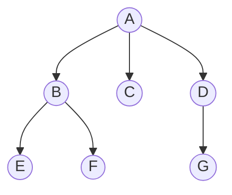
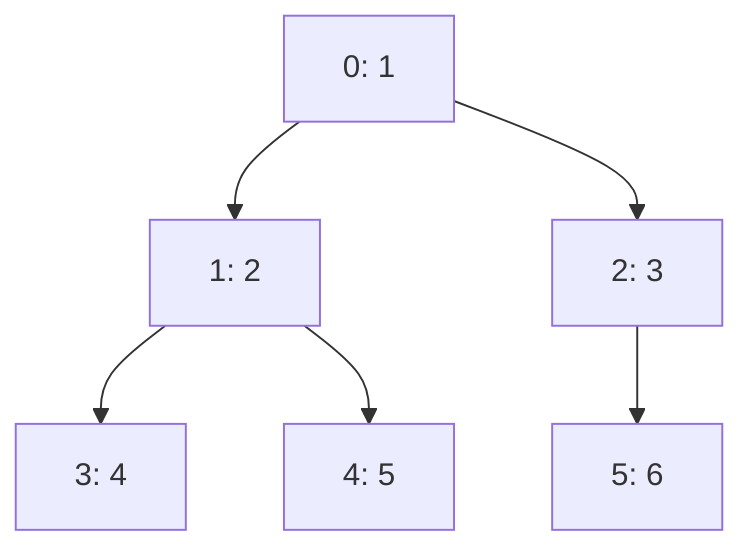
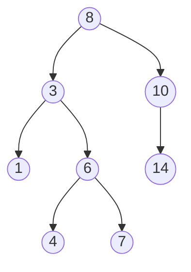
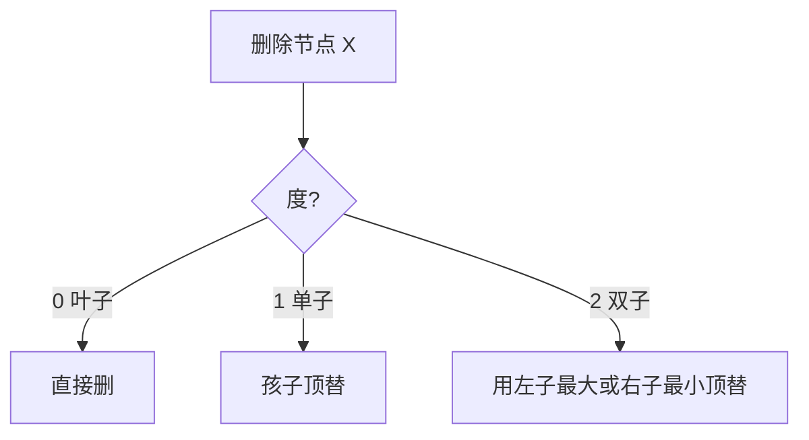
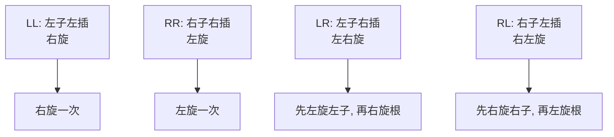
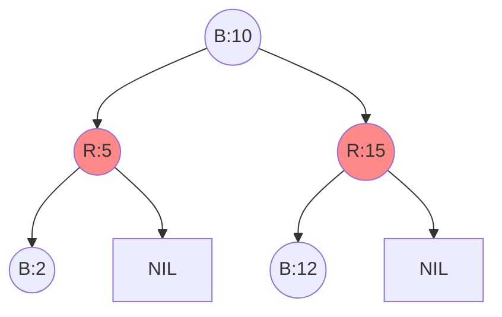
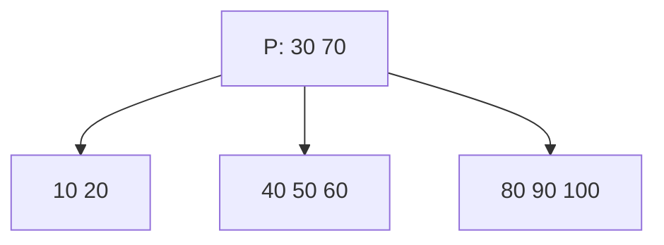
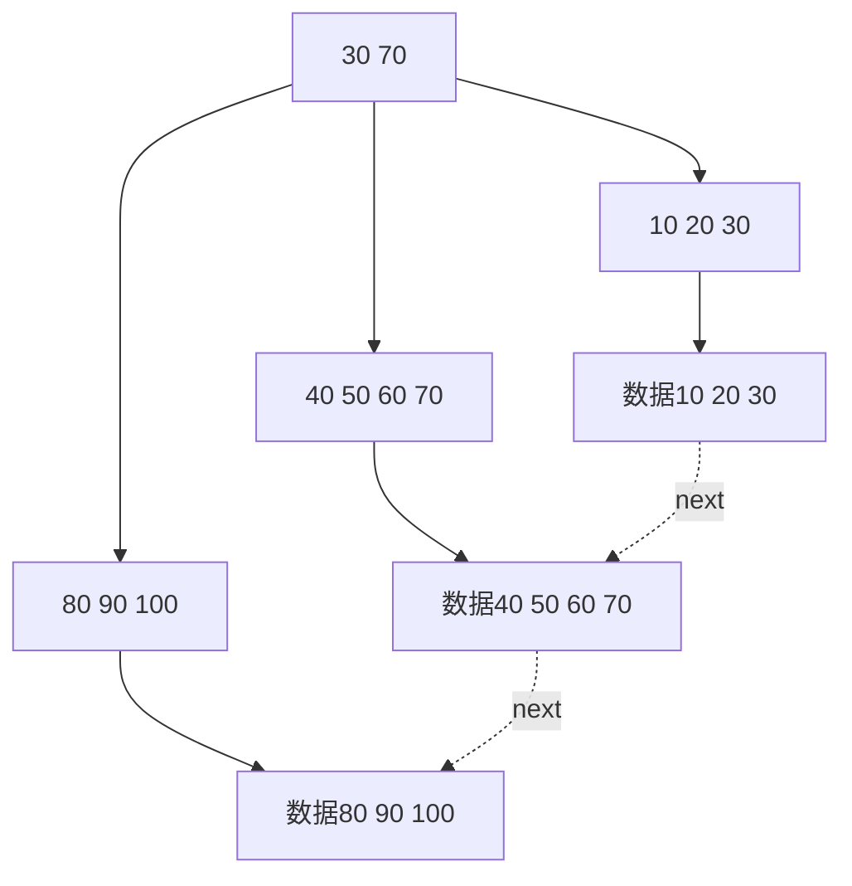
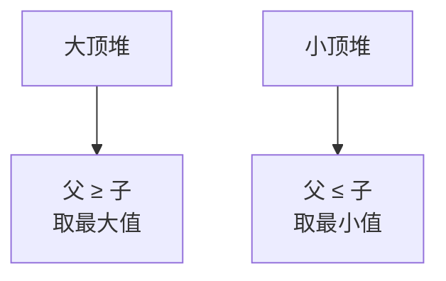
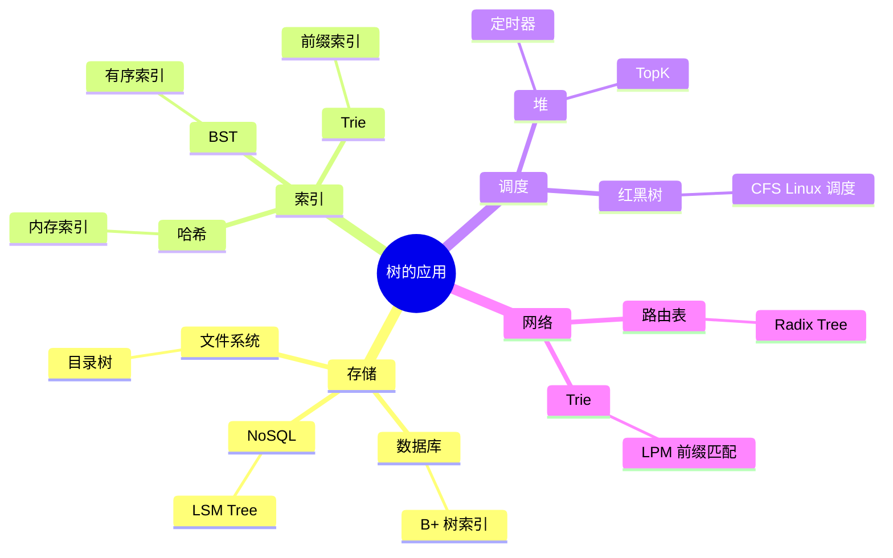

# 树

> 树是非线性的层次结构，是一对多关系的抽象。本章聚焦**结构与性质**，遍历题解见 [algorithm/二叉树与遍历.md](../algorithm/二叉树与遍历.md)。

## 一、树的基本概念

**树**：n（n≥0）个节点的有限集，n=0 时为空树。非空树满足：
- 有且仅有一个**根**节点
- 其余节点可分为 m（m>0）个互不相交的有限集，每个集合本身又是一棵树（**子树**）



### 1.1 关键术语

| 术语 | 含义 |
|------|------|
| 度（degree） | 节点拥有子树的个数 |
| 叶子（leaf） | 度为 0 的节点 |
| 分支节点 | 度非 0 的节点 |
| 孩子 / 双亲 | 直接后继 / 直接前驱 |
| 兄弟 | 同一双亲的孩子 |
| 层次 | 根为第 1 层，其孩子为第 2 层 |
| 深度（depth） | 最大层次数 |
| 高度 | 自底向上的层次 |
| 森林 | m（m≥0）棵互不相交的树的集合 |

### 1.2 重要性质

1. 节点数 = 度数之和 + 1（n = ∑度 + 1）
2. 度为 m 的树第 i 层至多 `m^(i-1)` 个节点
3. 高度 h 的 m 叉树至多 `(m^h - 1) / (m - 1)` 个节点
4. n 个节点的树有 `n - 1` 条边

## 二、二叉树

**二叉树**：每个节点至多两棵子树（区分左右）。

```go
type TreeNode struct {
    Val   int
    Left  *TreeNode
    Right *TreeNode
}
```

### 2.1 特殊形态

| 类型 | 定义 | 性质 |
|------|------|------|
| 满二叉树 | 每层都达到最大节点数 | n = 2^h - 1 |
| 完全二叉树 | 除最后一层外全满，最后一层从左到右连续 | 适合数组存储 |
| 二叉搜索树 BST | 左 < 根 < 右 | 中序遍历升序 |
| 平衡二叉树 AVL | 任意节点左右子树高度差 ≤ 1 | 严格平衡 |
| 红黑树 | 近似平衡 | 弱平衡条件 |

### 2.2 二叉树性质

1. 第 i 层至多 `2^(i-1)` 个节点
2. 深度 k 的二叉树至多 `2^k - 1` 个节点
3. 叶子数 `n0` = 度为 2 的节点数 `n2` + 1，即 `n0 = n2 + 1`
4. n 个节点的完全二叉树深度为 `⌊log₂ n⌋ + 1`

### 2.3 完全二叉树的数组存储

下标从 0 起，节点 i 的：
- 父节点：`(i - 1) / 2`
- 左孩子：`2i + 1`
- 右孩子：`2i + 2`



**应用**：堆、并查集（按秩压缩）、线段树、树状数组都用数组存储。

> 二叉树遍历（前/中/后/层序）与面试题解见 [algorithm/二叉树与遍历.md](../algorithm/二叉树与遍历.md)。

## 三、二叉搜索树 BST

### 3.1 定义

任一节点满足：左子树所有值 < 节点值 < 右子树所有值。



中序遍历：`1 3 4 6 7 8 10 14`（升序）。

### 3.2 操作

```go
type BST struct {
    root *TreeNode
}

func (t *BST) Search(v int) bool {
    p := t.root
    for p != nil {
        if v == p.Val {
            return true
        } else if v < p.Val {
            p = p.Left
        } else {
            p = p.Right
        }
    }
    return false
}

func (t *BST) Insert(v int) {
    t.root = insert(t.root, v)
}

func insert(root *TreeNode, v int) *TreeNode {
    if root == nil {
        return &TreeNode{Val: v}
    }
    if v < root.Val {
        root.Left = insert(root.Left, v)
    } else if v > root.Val {
        root.Right = insert(root.Right, v)
    }
    return root
}
```

| 操作 | 平均 | 最坏 |
|------|------|------|
| Search | O(logn) | O(n) |
| Insert | O(logn) | O(n) |
| Delete | O(logn) | O(n) |

**最坏情况**：依次插入 `1,2,3,4,5` 退化为链表。

### 3.3 删除策略



**双子节点删除**：找左子树最大值（前驱）或右子树最小值（后继）替换，再递归删除前驱/后继。

## 四、平衡二叉树 AVL

### 4.1 为什么需要平衡

BST 退化为链表后操作变 O(n)。AVL 通过**旋转**保持任意节点 `|左高 - 右高| ≤ 1`，保证 O(logn)。

### 4.2 四种失衡情况



### 4.3 旋转实现

```go
type AVLNode struct {
    Val    int
    Left   *AVLNode
    Right  *AVLNode
    Height int
}

func height(p *AVLNode) int {
    if p == nil {
        return 0
    }
    return p.Height
}

func updateHeight(p *AVLNode) {
    p.Height = 1 + max(height(p.Left), height(p.Right))
}

func balanceFactor(p *AVLNode) int {
    return height(p.Left) - height(p.Right)
}

// 右旋（LL 失衡）
func rotateRight(y *AVLNode) *AVLNode {
    x := y.Left
    y.Left = x.Right
    x.Right = y
    updateHeight(y)
    updateHeight(x)
    return x
}

// 左旋（RR 失衡）
func rotateLeft(x *AVLNode) *AVLNode {
    y := x.Right
    x.Right = y.Left
    y.Left = x
    updateHeight(x)
    updateHeight(y)
    return y
}

func balance(p *AVLNode) *AVLNode {
    updateHeight(p)
    bf := balanceFactor(p)
    switch {
    case bf > 1 && balanceFactor(p.Left) >= 0: // LL
        return rotateRight(p)
    case bf > 1:                                // LR
        p.Left = rotateLeft(p.Left)
        return rotateRight(p)
    case bf < -1 && balanceFactor(p.Right) <= 0: // RR
        return rotateLeft(p)
    case bf < -1:                                // RL
        p.Right = rotateRight(p.Right)
        return rotateLeft(p)
    }
    return p
}
```

### 4.4 AVL 的取舍

| 优点 | 缺点 |
|------|------|
| 严格平衡，查找最快 | 插入删除旋转频繁 |
| 高度严格 ≤ 1.44·logn | 不适合频繁修改场景 |
| 适合读多写少 | 实现复杂 |

## 五、红黑树

### 5.1 弱平衡思想

AVL 严格平衡导致频繁旋转。**红黑树放宽约束**：用颜色规则保证"最长路径 ≤ 2·最短路径"，操作 O(logn) 且旋转少。

### 5.2 五条性质

1. 每个节点**非红即黑**
2. **根**为黑
3. **叶子**（NIL）为黑
4. 红节点的孩子必为黑（**不能有连续红**）
5. 任一节点到其叶子所有路径**黑高相同**



### 5.3 旋转 + 变色

插入节点默认**红**，可能违反性质 4（父子同红）。通过**变色 + 至多 2 次旋转**修复：

| 叔叔颜色 | 操作 |
|---------|------|
| 红 | 父、叔变黑，祖父变红，向上递归 |
| 黑（或 NIL） | 旋转（LL/RR/LR/RL）+ 变色 |

删除节点涉及**双重黑**修复，逻辑复杂但**旋转次数 ≤ 3**。

### 5.4 工程实现清单

| 语言 | 实现 |
|------|------|
| C++ | `std::map`、`std::set` |
| Java | `TreeMap`、`HashMap` 链表转树阈值 8 时转红黑树 |
| Go | 不在标准库，社区 `github.com/HuKeping/rbtree` |
| Linux | `CFS` 调度器、`epoll` 内部 |
| Nginx | 共享内存红黑树 |

### 5.5 AVL vs 红黑树

| 维度 | AVL | 红黑树 |
|------|-----|------|
| 平衡度 | 严格 | 弱 |
| 查找 | 略快 | 略慢 |
| 插入删除 | 旋转多 | 旋转少 |
| 适合 | 静态/读多 | 动态/读写均衡 |
| 工程采用 | 数据库索引（少） | 语言标准库（多） |

## 六、B 树与 B+ 树

### 6.1 为什么需要多叉树

二叉树高度 log₂n，磁盘 IO 次数 = 高度。当 n=10^9 时仍需 30 次 IO。

**多叉树**降低高度：m=200 时，3 层可容纳 `200^3 = 8,000,000` 节点。

### 6.2 B 树

**m 阶 B 树**性质：
1. 节点至多 m 棵子树（m-1 个关键字）
2. 根非叶时至少 2 棵子树
3. 非根非叶节点至少 `⌈m/2⌉` 棵子树
4. 节点关键字有序，且作为子树分隔
5. **所有叶子同层**



**关键特性**：每个节点既存关键字也存数据。

### 6.3 B+ 树

**B+ 树是 B 树变种**：
1. 非叶节点只存关键字（**不存数据**），数据全在叶子
2. **叶子用链表串成有序链表**
3. 非叶节点是索引，叶子是数据



### 6.4 为什么数据库用 B+ 树

| 维度 | B 树 | B+ 树 |
|------|------|------|
| 单点查询 | 类似 | 类似 |
| 范围查询 | 需中序遍历 | 叶子链表 O(k) 扫描 |
| 节点存储 | 关键字 + 数据 | 仅关键字 |
| 单节点能容纳关键字 | 少 | 多（数据不占空间） |
| 树高 | 高 | 低（IO 次数少） |
| 适合 | 文件系统（部分场景） | 数据库索引 |

> MySQL InnoDB 主键索引采用 B+ 树，每页默认 16KB，单节点能放约 1170 个关键字（指针 + 主键），3 层可索引 2000 万行。

### 6.5 B 树家族

| 变种 | 特点 | 应用 |
|------|------|------|
| B 树 | 节点存数据 | 早期文件系统 |
| B+ 树 | 数据在叶子，链表 | MySQL、PostgreSQL |
| B* 树 | 节点更满（2/3 满） | 文件系统 |
| 2-3 树 | m=3 的 B 树 | 教学用 |
| 红黑树 | 2-3-4 树的等价二叉表示 | 标准库 |

## 七、堆（简述）

**堆**：完全二叉树 + 堆序性质（大顶堆父≥子，小顶堆父≤子）。



- 数组存储：父 `i`，孩子 `2i+1`、`2i+2`
- 操作复杂度：建堆 O(n)、插入/弹出 O(logn)、取顶 O(1)

> 结构原理与 Go 实现详见 [algorithm/堆与优先队列.md](../algorithm/堆与优先队列.md)。

## 八、树的应用场景



## 九、面试要点

### 9.1 高频概念题

1. **二叉树、BST、AVL、红黑树的关系？**
   - 二叉树是结构；BST 加排序约束；AVL 加严格平衡；红黑树放宽平衡条件。

2. **红黑树为什么用得比 AVL 多？**
   - AVL 严格平衡导致插入删除旋转频繁；红黑树旋转次数可控（插入 ≤ 2，删除 ≤ 3），适合动态场景。

3. **B 树和 B+ 树的区别？为什么数据库用 B+ 树？**
   - B+ 树数据在叶子，非叶节点更紧凑树更矮；叶子链表支持范围扫描；IO 次数少。

4. **完全二叉树为什么适合数组存储？**
   - 下标能直接算父子关系，无指针开销，缓存友好；堆、线段树都基于此。

5. **为什么 HashMap 链表长度 ≥ 8 转红黑树？**
   - 红黑树最坏 O(logn)，链表最坏 O(n)；阈值 8 是基于泊松分布的概率设计（hash 均匀时几乎不触发）。

6. **AVL 4 种旋转如何区分？**
   - 看插入位置：左子的左（LL）→ 右旋；右子的右（RR）→ 左旋；左子的右（LR）→ 先左后右；右子的左（RL）→ 先右后左。

7. **堆和 BST 的区别？**
   - 堆只要求父子关系，BST 要求全局有序；堆取最值 O(1)，BST 中序遍历有序；堆用数组，BST 用链表。

### 9.2 易错点

1. **AVL 平衡因子计算**：左高减右高，叶子节点为 0；空节点高度 0，叶子高度 1。
2. **BST 删除双子节点**：用前驱或后继替换，**不是直接删**。
3. **B 树高度定义**：从根到叶的层数，根也算一层。
4. **红黑树插入默认红色**：减少性质违反（黑高改变会影响所有路径）。
5. **B+ 树范围查询**：先单点查到入口，再沿叶子链表遍历，**不是中序遍历**。

### 9.3 选型决策

| 需求 | 推荐 |
|------|------|
| 内存有序、读写均衡 | 红黑树 |
| 内存有序、读远大于写 | AVL |
| 磁盘有序、单点查询 | B 树 |
| 磁盘有序、范围查询 | B+ 树 |
| 取最值 / TopK | 堆 |
| 前缀匹配 | Trie / Radix Tree |
| 区间查询、动态排名 | 线段树 / 树状数组 |
| 区间最值 + 修改 | 线段树 |

## 十、参考资料

- 《大话数据结构》第 6 章 树
- 《算法导论》第 12-13 章 二叉搜索树、红黑树
- 《数据库系统概念》第 11 章 索引
- [红黑树可视化](https://www.cs.usfca.edu/~galles/visualization/RedBlack.html)
- [B+ 树可视化](https://www.cs.usfca.edu/~galles/visualization/BPlusTree.html)
