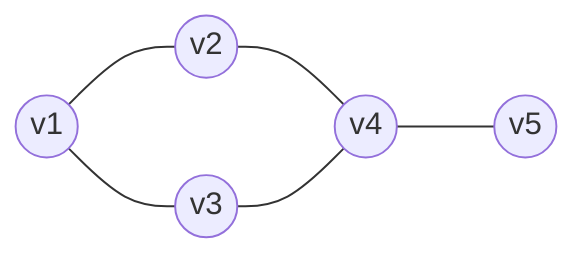
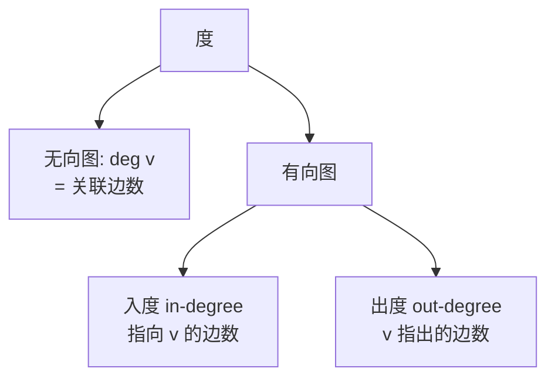
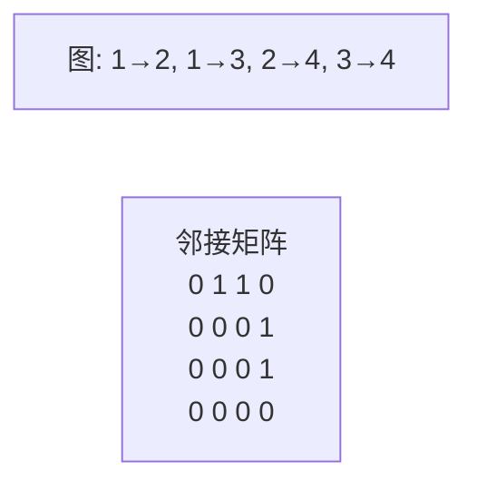
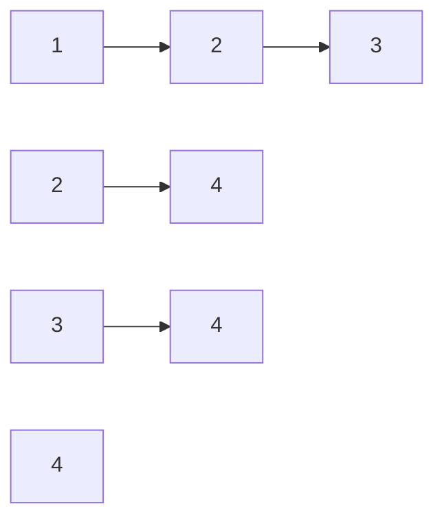
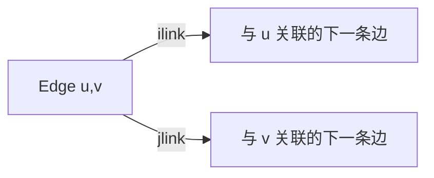
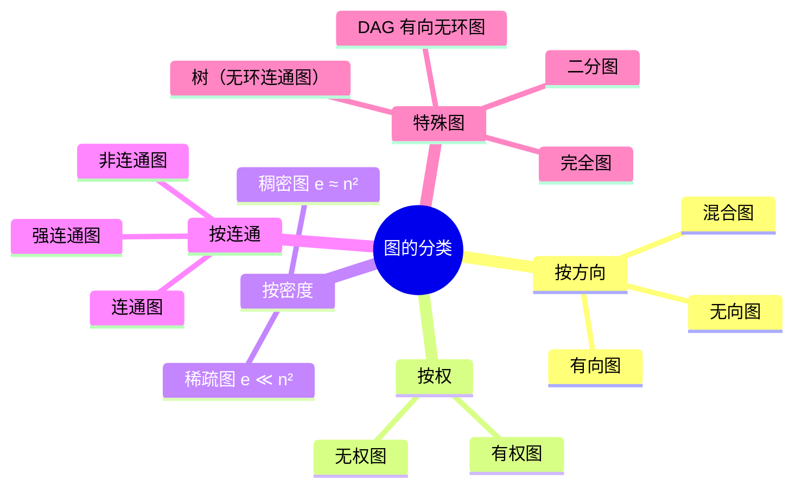
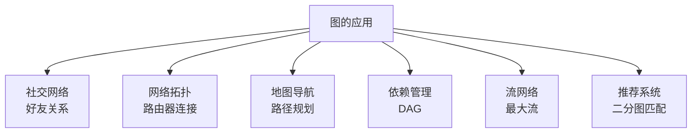

# 图

> 图是多对多关系的抽象，比树更一般。本章聚焦**图的存储结构**，DFS/BFS、最短路、拓扑排序等算法见 [algorithm/图的DFS与BFS.md](../algorithm/图的DFS与BFS.md)。

## 一、图的定义

**图 G = (V, E)**：由顶点集 V 和边集 E 组成。



| 记法 | 含义 |
|------|------|
| `|V|` | 顶点数（常用 n） |
| `|E|` | 边数（常用 e） |
| `(u, v)` | 无向边 |
| `<u, v>` | 有向边（u→v） |
| `w(u, v)` | 边上的权 |

## 二、基本概念

### 2.1 无向图 vs 有向图

| 类型 | 边 | 度 | 自环 | 平行边 |
|------|---|----|------|------|
| 无向图 | (u,v) = (v,u) | deg(v) 关联边数 | 允许 | 允许（多重图） |
| 有向图 | `<u,v> ≠ <v,u>` | 入度 + 出度 | 允许 | 允许 |

### 2.2 度、连通



**握手定理**：所有顶点度数之和 = 2·边数；有向图中入度和 = 出度和 = 边数。

**连通**：
- 无向图：u 到 v 有路径
- **连通分量**：极大连通子图
- 有向图：u、v 相互可达称为**强连通**
- **强连通分量**：极大强连通子图

### 2.3 完全图

| 类型 | 边数 |
|------|------|
| 无向完全图 | n(n-1)/2 |
| 有向完全图 | n(n-1) |

### 2.4 子图、生成树

- **子图**：V' ⊆ V, E' ⊆ E
- **生成子图**：V' = V
- **生成树**：连通图的极小连通生成子图，n 个顶点 n-1 条边

## 三、图的存储结构

存储要解决两个问题：**顶点**怎么存、**边**怎么存。

### 3.1 邻接矩阵

**结构**：用 `n×n` 二维数组 `A`，`A[i][j]` 表示边 `<i,j>` 是否存在或权重。

```go
// 无权图
var adj [][]bool  // adj[i][j]=true 表示有边
// 有权图
var weight [][]int  // 无边用 ∞ 表示
```



| 性质 | 说明 |
|------|------|
| 空间 | O(n²) |
| 查边 `<u,v>` | O(1) |
| 求度 | O(n) |
| 增删边 | O(1) |
| 适合 | 稠密图、需快速查边 |

**无向图邻接矩阵对称**：可只存上三角，节省一半空间。

### 3.2 邻接表

**结构**：顶点数组 + 每个顶点带一个链表，存其邻接点。

```go
type EdgeNode struct {
    To   int
    W    int
    Next *EdgeNode
}

type Graph struct {
    Heads []*EdgeNode  // 长度 n
}

func (g *Graph) AddEdge(u, v, w int) {
    g.Heads[u] = &EdgeNode{
        To: v, W: w, Next: g.Heads[u],
    }
}
```



| 性质 | 说明 |
|------|------|
| 空间 | O(n + e) |
| 查边 `<u,v>` | O(deg(u)) |
| 求出度 | O(deg(u))（直接读链表长度） |
| 求入度 | O(n+e)（需遍历所有表） |
| 适合 | 稀疏图 |

### 3.3 邻接矩阵 vs 邻接表

| 维度 | 邻接矩阵 | 邻接表 |
|------|---------|------|
| 空间 | O(n²) | O(n+e) |
| 查边 | O(1) | O(度数) |
| 遍历邻接点 | O(n) | O(度数) |
| 适合 | 稠密图 | 稀疏图 |
| 增删边 | O(1) | O(度数) |
| 实现复杂度 | 简单 | 中等 |

**经验值**：当 `e ≈ n²` 时邻接矩阵更好；`e ≪ n²` 时邻接表更好。实际工程中绝大多数图是稀疏的，邻接表更常用。

### 3.4 十字链表（有向图专用）

邻接表求入度不便，**十字链表**把出边和入边都串起来：

```go
type OrthoEdge struct {
    TailVex  int        // 弧尾下标
    HeadVex  int        // 弧头下标
    TailLink *OrthoEdge // 同弧尾的下一条边（出边链）
    HeadLink *OrthoEdge // 同弧头的下一条边（入边链）
    W        int
}

type OrthoVertex struct {
    Data       interface{}
    FirstIn    *OrthoEdge  // 第一条入边
    FirstOut   *OrthoEdge  // 第一条出边
}
```

```mermaid
flowchart LR
    subgraph 有向边 <u,v>
        Tail[u] -->|tlink| TailNext[同 tail 的下一条]
        Tail[u] -->|hlink| HeadNext[同 head 的下一条]
    end
```

| 性质 | 说明 |
|------|------|
| 空间 | O(n + e) |
| 查出度 | O(出度) |
| 查入度 | O(入度) |
| 删边 | O(度数) |
| 适合 | 有向图、需频繁查入度 |

**应用**：有向图的强连通分量、AOV 网。

### 3.5 邻接多重表（无向图专用）

无向图中，邻接表里同一条边 `(u,v)` 在 u 和 v 的链表里各出现一次，删除时需两边修改。

**邻接多重表**：每条边只存一个节点，同时挂在 u 和 v 的链表上：

```go
type MultiEdge struct {
    Marked   bool
    IVex     int           // 顶点 i 下标
    ILink    *MultiEdge    // 依附于顶点 i 的下一条边
    JVex     int           // 顶点 j 下标
    JLink    *MultiEdge    // 依附于顶点 j 的下一条边
    W        int
}

type MultiVertex struct {
    Data       interface{}
    FirstEdge  *MultiEdge
}
```



| 性质 | 说明 |
|------|------|
| 空间 | O(n + e)（每条边一个节点） |
| 删边 | O(度数)，单节点修改 |
| 适合 | 无向图、需频繁删边 |

### 3.6 存储结构对比

| 结构 | 适用图类型 | 空间 | 入度查询 | 删边 | 主要场景 |
|------|----------|------|---------|------|---------|
| 邻接矩阵 | 通用 | O(n²) | O(n) | O(1) | 稠密图、查边频繁 |
| 邻接表 | 通用 | O(n+e) | O(n+e) | O(度数) | 稀疏图、DFS/BFS |
| 十字链表 | 有向 | O(n+e) | O(入度) | O(度数) | 强连通、AOV |
| 邻接多重表 | 无向 | O(n+e) | O(度数) | O(度数) | 无向图删边 |

### 3.7 边集数组

把所有边存到一维数组，每条边记录两个顶点：

```go
type Edge struct {
    U, V int
    W    int
}

type EdgeGraph struct {
    V     []interface{}
    Edges []Edge
}
```

| 性质 | 说明 |
|------|------|
| 空间 | O(n + e) |
| 查边 | O(e) |
| 适合 | Kruskal、遍历所有边 |

**应用**：Kruskal 最小生成树、Bellman-Ford 等需要遍历所有边的算法。

## 四、图的分类



### 4.1 特殊图

| 类型 | 定义 | 应用 |
|------|------|------|
| DAG | 有向无环图 | 拓扑排序、依赖管理 |
| 二分图 | 顶点可分两集，边只跨集合 | 匹配、推荐 |
| 完全图 | 任意两顶点相连 | 概率分析 |
| 树 | 无环连通图 | 嵌套关系 |
| AOV 网 | 顶点表示活动的 DAG | 任务依赖 |
| AOE 网 | 边表示活动的带权 DAG | 关键路径 |

## 五、应用与存储选型

### 5.1 典型应用



### 5.2 选型决策

| 场景 | 推荐存储 |
|------|---------|
| 社交网络（稀疏） | 邻接表 |
| 地图导航（稀疏带权） | 邻接表 + 优先队列 |
| 任务依赖（DAG） | 邻接表 + 入度数组 |
| 频繁查边、稠密 | 邻接矩阵 |
| 强连通分量 | 十字链表 / 邻接表 |
| Kruskal MST | 边集数组 |
| 网格图 | 直接用二维数组 + 方向数组 |

## 六、面试要点

### 6.1 高频概念题

1. **邻接矩阵和邻接表的区别？**
   - 邻接矩阵 O(n²) 空间、查边 O(1)，适合稠密图；邻接表 O(n+e) 空间、查边 O(度数)，适合稀疏图。

2. **为什么社交网络用邻接表不用邻接矩阵？**
   - 真实社交网络稀疏（平均度数远小于 n），邻接表 O(n+e) 远小于 O(n²)。

3. **十字链表解决了什么问题？**
   - 有向图邻接表求入度需 O(n+e) 扫描；十字链表把入边、出边各串一链，求入度 O(入度)。

4. **邻接多重表相比邻接表的优势？**
   - 无向图邻接表同一条边存两份，删边需改两处；邻接多重表单节点同时挂两边，删边 O(度数) 单次修改。

5. **如何判断图中是否有环？**
   - 无向图：DFS 中遇到已访问且非父节点的点；或并查集合并时发现已同集。
   - 有向图：DFS 三色标记遇到灰节点；或拓扑排序后未处理完所有节点。

6. **DAG 和树的区别？**
   - 树是无向无环连通图；DAG 是有向无环图，可能不连通；DAG 的"生成树"特指 DFS/BFS 生成树。

### 6.2 易错点

1. **邻接矩阵空间**：无向图可压缩到上三角，但工程实现通常仍用全矩阵（写代码简单、查询快）。
2. **邻接表删除边**：有向图改一条链，无向图需改两条链（或用邻接多重表）。
3. **入度数组维护**：拓扑排序前要先遍历所有边构造入度数组，O(e) 一次。
4. **稀疏图阈值**：经验上 `e < n·logn` 视为稀疏。
5. **DAG 的判断**：无环 ≠ 必有入度为 0 的点（但连通 DAG 一定有），用 Kahn 算法判断更可靠。

### 6.3 选型对比

| 选项 | 适合 |
|------|------|
| 邻接矩阵 | 稠密图、频繁查边、节点数小（< 千） |
| 邻接表 | 稀疏图、遍历邻接点、工程通用 |
| 十字链表 | 有向图、强连通分析 |
| 邻接多重表 | 无向图、频繁删边 |
| 边集数组 | Kruskal、Bellman-Ford |

## 七、参考资料

- 《大话数据结构》第 7 章 图
- 《算法导论》第 22 章 图的基本算法
- 《数据结构》严蔚敏 第 7 章 图
- [图的存储可视化](https://visualgo.net/zh/graph)
