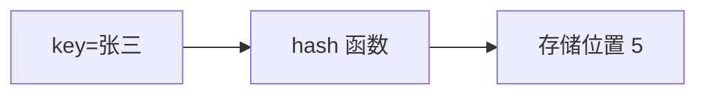
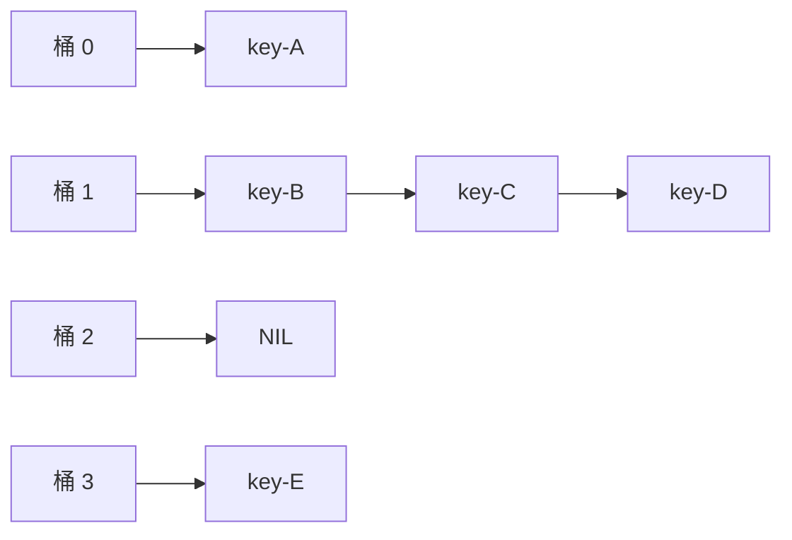
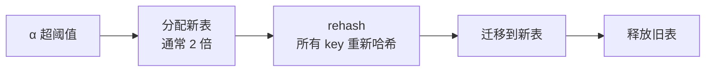
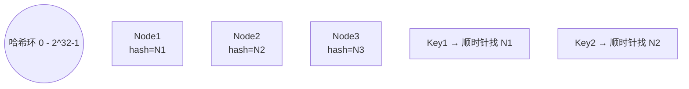
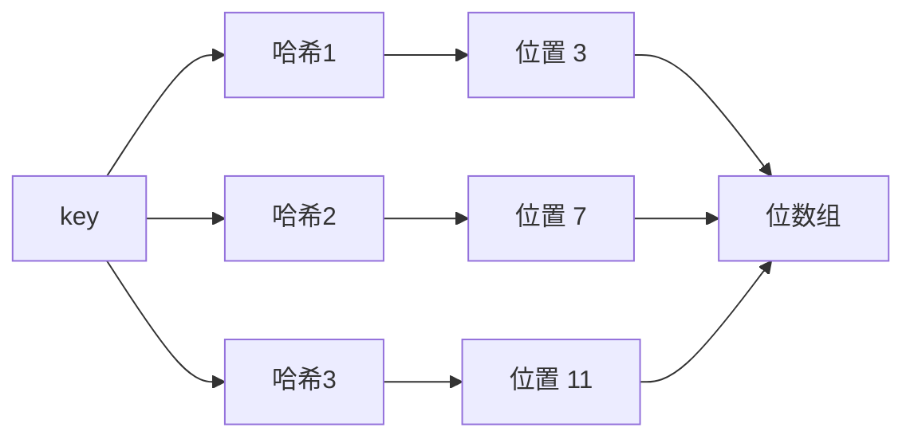

# 散列表

> 散列表（哈希表）通过哈希函数把关键字映射到存储位置，平均 O(1) 查找。本章聚焦**结构与冲突处理**，哈希查找的算法视角见 [algorithm/查找.md](../algorithm/查找.md)。

## 一、散列表的思想

**核心思想**：用一个函数 `hash(key)` 直接算出存储位置，跳过比较过程。



```go
type HashTable struct {
    table []*Entry
    size  int
}

type Entry struct {
    Key   string
    Value interface{}
    Next  *Entry  // 链地址法时使用
}
```

| 操作 | 平均 | 最坏 |
|------|------|------|
| Search | O(1) | O(n) |
| Insert | O(1) | O(n) |
| Delete | O(1) | O(n) |

> 最坏发生于所有 key 都哈希到同一位置（哈希碰撞攻击）。

## 二、哈希函数

### 2.1 设计原则

1. **均匀分布**：把 key 尽量散到不同槽
2. **计算快**：O(1) 或接近
3. **雪崩效应**：输入微小变化，输出剧烈变化
4. **确定性**：同一 key 永远哈希到同一位置

### 2.2 常见构造方法

| 方法 | 公式 | 适用 |
|------|------|------|
| 直接定址 | `hash(key) = a·key + b` | key 连续、范围小 |
| 除留余数 | `hash(key) = key mod p` | 通用，p 取素数 |
| 数字分析 | 取 key 中分布均匀的几位 | 已知 key 分布 |
| 平方取中 | 取 key² 中间几位 | 不知分布 |
| 折叠 | key 分段叠加 | key 较长 |
| 随机数 | `hash(key) = rand(key)` | 不实用 |

**除留余数法**最常用：

```go
func hashInt(key int, size int) int {
    return key % size
}
```

### 2.3 字符串哈希

```go
// 多项式滚动哈希（BKDR）
const (
    seed = 31
    mod  = 1_000_000_007
)

func hashStr(s string) int {
    h := 0
    for i := 0; i < len(s); i++ {
        h = (h*seed + int(s[i])) % mod
    }
    return h
}
```

| 算法 | 速度 | 分布 | 应用 |
|------|------|------|------|
| BKDR | 快 | 良好 | 通用 |
| DJB2 | 快 | 优秀 | 字符串 |
| FNV-1a | 中 | 优秀 | 哈希表、校验 |
| MurmurHash | 中 | 极好 | Redis、Memcached |
| SHA-1/SHA-256 | 慢 | 完美 | 加密、防碰撞 |

### 2.4 Go map 的哈希函数

Go runtime 内置基于 **AES** 指令的快速哈希（CPU 支持 AES-NI 时），无 AES 时退到 memhash 算法。key 的哈希由编译器根据 key 类型自动生成对应的 hash 函数。

## 三、冲突解决

`hash` 不是一一映射，必然冲突。

### 3.1 开放寻址法

冲突时**找下一个空槽**。

#### 线性探测

```go
func (h *HashTable) findSlot(key string, i int) int {
    slot := hash(key) % h.size
    for j := 0; j < h.size; j++ {
        probe := (slot + j) % h.size
        if h.table[probe] == nil || h.table[probe].Key == key {
            return probe
        }
    }
    return -1
}
```

**问题**：易产生**聚集（primary clustering）**，连续的占用槽越长越容易碰撞。

#### 二次探测

```
probe(k) = (hash(key) + k²) mod size
```

缓解线性探测的聚集，但仍存在**二次聚集**（哈希到同一槽的 key 探测序列相同）。

#### 双重哈希

```
probe(k) = (hash1(key) + k · hash2(key)) mod size
```

- `hash2(key)` 与 `hash1(key)` 不同，且 `hash2(key)` 与 size 互质
- 彻底消除聚集

**对比**：

| 探测法 | 实现难度 | 性能 | 缺点 |
|-------|---------|------|------|
| 线性 | 简单 | 一般 | 一次聚集 |
| 二次 | 中 | 较好 | 二次聚集 |
| 双重 | 中 | 最好 | hash2 设计难 |

### 3.2 链地址法（拉链法）

每个槽挂一个链表，冲突的 key 直接挂在同一桶。

```go
func (h *HashTable) Insert(key string, value interface{}) {
    slot := hashStr(key) % h.size
    head := h.table[slot]
    for p := head; p != nil; p = p.Next {
        if p.Key == key {
            p.Value = value  // 已存在则更新
            return
        }
    }
    h.table[slot] = &Entry{Key: key, Value: value, Next: head}
}
```



**链表长度过长时换成红黑树**：Java 8 `HashMap` 链表长度 ≥ 8 且表长 ≥ 64 时转红黑树，避免哈希碰撞攻击。

### 3.3 两种方法对比

| 维度 | 开放寻址 | 链地址 |
|------|---------|------|
| 空间 | 仅数组，密度高 | 数组 + 链表节点 |
| 装填因子上限 | 必须 < 1（一般 ≤ 0.75） | 可 > 1 |
| 缓存命中 | 高（数据连续） | 一般 |
| 删除 | 需"墓碑"标记，否则影响查找 | 直接摘链 |
| 适合 | 内存紧凑、key 已知 | 通用、动态扩容 |

### 3.4 再哈希法

同时准备多个哈希函数，冲突时换下一个。较少使用。

## 四、装填因子与扩容

### 4.1 装填因子 α

```
α = 已存元素数 / 表长
```

| 实现 | 阈值 | 触发动作 |
|------|------|---------|
| 开放寻址 | α ≥ 0.7 | 扩容 |
| 链地址 | α ≥ 1（经验 0.75） | 扩容 |

### 4.2 扩容过程



```go
func (h *HashTable) resize() {
    oldTable := h.table
    h.size *= 2
    h.table = make([]*Entry, h.size)
    for _, head := range oldTable {
        for p := head; p != nil; {
            next := p.Next
            slot := hashStr(p.Key) % h.size
            p.Next = h.table[slot]
            h.table[slot] = p
            p = next
        }
    }
}
```

**问题**：一次性 rehash 在大表上会造成**延迟尖峰**。

### 4.3 增量扩容

为避免一次性扩容卡顿，工程实现采用**渐进式扩容**：

| 系统 | 实现 |
|------|------|
| Go map | 扩容时新旧桶并存，每次访问搬迁 1-2 个桶 |
| Redis dict | rehashidx 指针，每次操作搬迁一个桶 |
| Java HashMap | 一次性扩容（newTable → transfer） |

### 4.4 缩容

删除大量元素后 α 过低可缩容，避免内存浪费。Redis 在元素数 < 桶数 10% 时触发缩容。

## 五、一致性哈希（工程视角）

### 5.1 经典哈希的扩容问题

`hash(key) mod N`：当节点数 N 变化时，几乎所有 key 重新映射，缓存大面积失效。

### 5.2 一致性哈希原理

把哈希值空间视为**环**，节点和 key 都映射到环上，key 顺时针找到的第一个节点负责。



**加节点 N4**：只影响 N4 到前一个节点之间一小段 key，其他 key 不动。

### 5.3 虚拟节点

节点少时环上分布不均，引入**虚拟节点**：每个物理节点对应 100-200 个虚拟节点，散布到环上。

```go
type ConsistentHash struct {
    ring    []uint32       // 排序后的虚拟节点 hash
    vnode   map[uint32]string  // 虚拟节点 → 物理节点
    replicas int            // 每节点虚拟节点数
}

func (c *ConsistentHash) AddNode(node string) {
    for i := 0; i < c.replicas; i++ {
        h := hashStr(fmt.Sprintf("%s#%d", node, i))
        c.ring = append(c.ring, h)
        c.vnode[h] = node
    }
    sort.Slice(c.ring, func(i, j int) bool {
        return c.ring[i] < c.ring[j]
    })
}

func (c *ConsistentHash) GetNode(key string) string {
    if len(c.ring) == 0 {
        return ""
    }
    h := hashStr(key)
    idx := sort.Search(len(c.ring), func(i int) bool {
        return c.ring[i] >= h
    })
    if idx == len(c.ring) {
        idx = 0
    }
    return c.vnode[c.ring[idx]]
}
```

| 实现 | 节点变动影响 | 均衡度 |
|------|------------|------|
| `mod N` | 几乎全部迁移 | 完美 |
| 一致性哈希（无虚拟节点） | 1/N 的 key | 不均 |
| 一致性哈希（带虚拟节点） | 1/N 的 key | 良好 |

**应用**：Memcached、Redis Cluster（带槽位 16384）、Cassandra、Dubbo。

## 六、布隆过滤器（衍生结构）

### 6.1 思想

用位数组 + k 个哈希函数判断元素**可能存在**或**一定不存在**。



### 6.2 性质

- **可能误判**：所有位置都为 1，但元素未真正加入
- **不会漏判**：如果有任意位置为 0，元素一定未加入
- **不能删除**：删除会影响其他元素

| 操作 | 复杂度 |
|------|------|
| Add | O(k) |
| Test | O(k) |
| 空间 | m bit |

### 6.3 工程应用

- **缓存击穿防护**：查询前先用 Bloom Filter 过滤
- **爬虫去重**：URL 集合
- **黑名单**：垃圾邮件、恶意 IP
- **HBase**：HFile 索引、RowKey 存在性判断

> **Counting Bloom Filter**：位数组换成计数器支持删除，但空间翻 4-8 倍。

## 七、面试要点

### 7.1 高频概念题

1. **哈希表的查找为什么是 O(1)？什么时候不是？**
   - 哈希函数直接算位置，无需比较；冲突严重时退化为链表查找 O(n)。

2. **开放寻址和链地址的区别？**
   - 开放寻址数据连续、缓存友好、装填因子必须 < 1；链地址可超过 1、删除简单、动态扩容友好。

3. **HashMap 链表长度 ≥ 8 转 Red-Black 树，阈值怎么来的？**
   - 哈希均匀时链表长度服从泊松分布，长度 ≥ 8 的概率 ≈ 0.00000006；阈值是空间与最坏复杂度的折衷。

4. **装填因子为什么影响性能？**
   - α 越大冲突越多，平均查找长度 ASL 增长。开放寻址的 ASL 随 α 趋近 1 急剧上升。

5. **为什么一致性哈希要虚拟节点？**
   - 物理节点少时环上分布不均，单节点负载可能差几倍；虚拟节点把环切细，让负载均衡。

6. **Bloom Filter 误判率怎么控制？**
   - 增加位数组长度 m、增加哈希函数数量 k；最优 k ≈ (m/n)·ln2。

7. **为什么 Java HashMap 容量是 2 的幂？**
   - 用 `hash & (cap - 1)` 替代 `mod`，速度更快；扩容时只需判断高位是否为 1，迁移效率高。

### 7.2 易错点

1. **链地址法删除**：直接摘链即可；开放寻址删除需用"墓碑"标记，否则会破坏探测链。
2. **Go map 非线程安全**：并发读写会 panic；用 `sync.Map` 或加锁。
3. **扩容时机**：先扩容再插入，不能等满了才扩（α 太高查找慢）。
4. **哈希碰撞攻击**：恶意构造 key 全哈希到同一桶，造成 O(n) 退化；Java 用 `treeifyThreshold` + 随机 hash 种子防御。
5. **一致性哈希加节点**：迁移的 key 是**新节点逆时针到上一个节点之间的 key**，不是顺时针。
6. **Bloom Filter 不能删**：单 bit 可能被多个元素共享；要删请用 Counting Bloom Filter。

### 7.3 选型对比

| 场景 | 推荐 |
|------|------|
| 通用内存哈希表 | 链地址法 |
| 内存紧凑、key 已知 | 开放寻址（双重哈希） |
| 分布式缓存分片 | 一致性哈希 + 虚拟节点 |
| 元素存在性判断 | Bloom Filter |
| 频繁删除的 Bloom | Counting Bloom Filter |
| 需要排序、范围查询 | 红黑树 / B+ 树（不能用哈希表） |

## 八、参考资料

- 《大话数据结构》第 8 章 查找（哈希表部分）
- 《算法导论》第 11 章 散列表
- [一致性哈希算法原理](https://zh.wikipedia.org/wiki/一致哈希)
- Go map 源码 `src/runtime/map.go`
- [Bloom Filter Calculator](https://hur.st/bloomfilter/)
